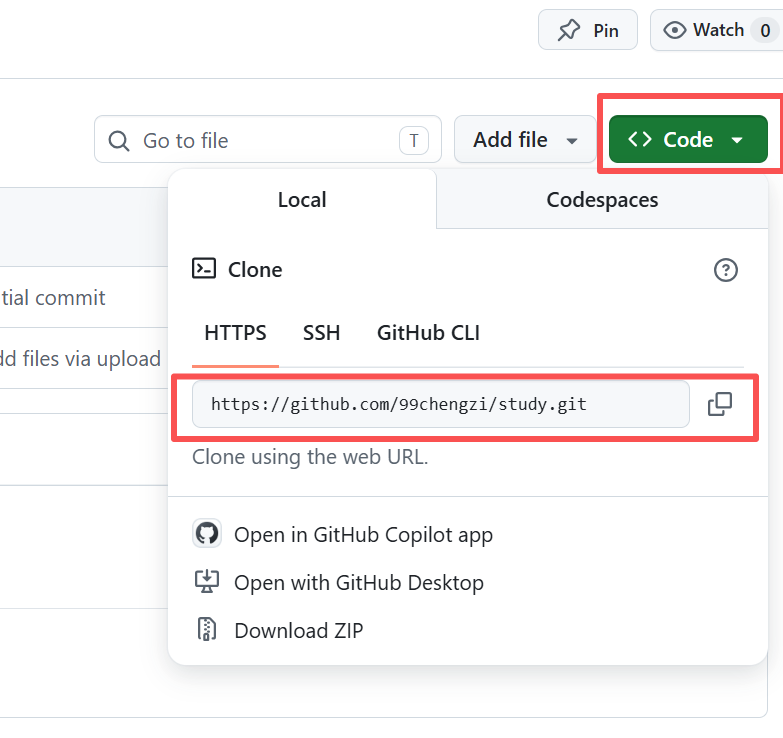
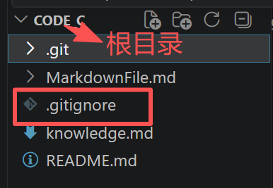

# <center><font face ="仿宋" font color=orange size=10>git & github</font>
# 一. 概念辨析
### 1.git
> 功能：版本控制———保存各种历史版本
#### local repository本地仓库-->remote repository远端仓库
> git管理本地的代码仓库

> github就相当于一个免费的远端仓库

存档、仓库、项目在git里是一个东西
# 二. 前期准备
#### 下载VS code、git
#### 注册github账号并创建一个仓库
##### 若打开github遇网络问题可使用==Watt Toolkit Installer==进行网络加速
# 三. 一些注意事项
`git remote remove origin`
> 这条命令可以删除错误的远程绑定

`git remote -v`
> 这条命令可以查看当前绑定的远程地址

`git remote add origin`+==要绑定的地址==
> 重新绑定正确的 study 仓库地址

==要绑定的地址==

==每次更改后要ctrl+s(保存)才能上传到github==
#### 更改处的提交信息输入框可以这么填：
> 新增内容：feat: 新增git远程管理笔记
修改完善：docs: 完善github绑定、推送步骤
修正错误：fix: 修正git add命令写法错误

#### 解决新建文件自动显示 U（未追踪）、不想提交的问题(不删原文件的情况):
1. 在项目根目录新建 .gitignore 文件
在左侧资源管理器空白处右键 → 新建文件，文件名直接输入：
.gitignore

> 注意：文件名前面必须带小数点，不能少。
2. 打开 .gitignore，写入忽略规则
你现在不想管整个 text 文件夹，直接写：
```
# 忽略整个text文件夹
text/
```
如果只想忽略里面单个文件 cyj.py，就写：
```
text/cyj.py
```
写完按 Ctrl+S 保存。
3. 执行：
```
git add .gitignore
git commit -m "添加忽略规则，屏蔽text文件夹"
```
4. 终端执行提交更新
```
git add .gitignore
git commit -m "补充忽略规则，屏蔽text目录"
```
##### 最终效果:
提交完成后，VS Code 左侧源代码管理就不会再弹出 text 文件夹的 U 标记，以后在 text 里新建 / 修改任何文件，Git 都会自动无视，不会干扰你上传笔记到 GitHub。