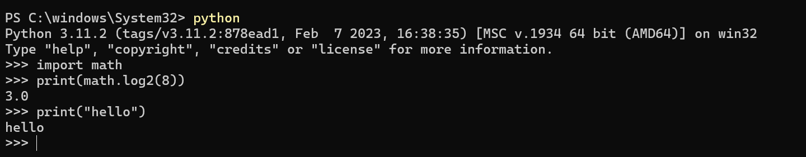
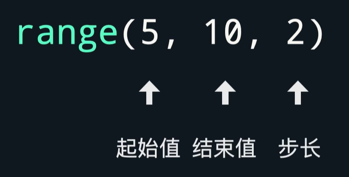
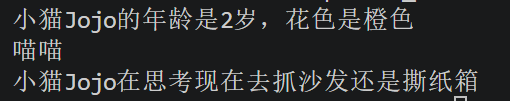

## 一. 一些语法
+ \n 表示换行
+ 每个print默认另起一行
+ 三个"""可以实现多内容跨行操作
  > """文本"""

  要是前面不加任何东西，就是注释
  注释还可以用# 
+ Python 中 "+" 对字符串的作用是字符串拼接，只会把文本直接连在一起，不会自动添加空格。
`print("你好"+"这是一句代码"+"哈哈")`
   > 你好这是一句代码哈哈
+ n//2(两个//)是向下取整的意思
+ 如果字符串用单引号包起来，想在字符串内写一个单引号，就要用反斜杠\转义，写成\'
  `print("I\'m student!")`
  >I'm student!
+ 字母全部小写，不同单词用下划线分隔
  >==下划线命名法==(定义普通变量时)
  > user_name  user_age
## 二. 数学运算
+ 计算2的三次方 
  ```
  s=2**3;
  print(s)
  ```
+ python的math库函数
  ```
  import math
  print(math.sin(1))
  print(math.log2(8))
  ```
+ 计算平方根
  ```
  import math
  print(math.sqrt(x))
  ```
  或者直接写成
  `print(x**1/2)`
## 三. 数据类型
### 1.字符串str
   1. len('\n')字符串长度==1==
   2. 索引"lucky"[3]得到"k"
   + 索引是从0开始的
   3. python格式化字符串：
**format 方法：**
```
message_content="""
律回春渐，新元肇启。
新岁甫至，福气东来。
金{0}贺岁，欢乐祥瑞。
金{0}敲门，五福临门。
给{1}及家人拜年啦!
新春快乐，{0}年大吉!
""".format(year,name)
```
> {0}表示format括号里第一个参数，{1}表示format括号里第二个参数
> format打印时不需要手动转换成字符串

**f-string 最简写法:**
```
print(f"小猫{cat1.name}的年龄是{cat1.age}岁，花色是{cat1.color}")
```
字符串前加 f，大括号 {} 里直接写变量，自动识别数字、字符串，不用转换。
> {gpa:.2f}可以保留两位小数
==：.2f==
### 2.整数int 浮点数float
### 3.布尔类型bool
+ ==T==rue 和 ==F==alse首字母必须严格大写
### 4.空值类型NoneType
`my_love=None` ***==N==要大写***
```
print(type(10))          # <class 'int'> 整数
print(type(3.14))        # <class 'float'> 浮点数
print(type("abc"))       # <class 'str'> 字符串
print(type(True))        # <class 'bool'> 布尔值
print(type([1,2,3]))     # <class 'list'> 列表
print(type({"a":1}))     # <class 'dict'> 字典
```
## 四. Python 交互模式
> + 平时用的是<u>命令行模式</u>
> + <u>Python 交互模式</u>:输入一行代码，<u>立刻执行一行、马上出结果</u>，不用新建.py文件，适合临时测试小段代码、查语法。
 可以不用写==print==就可以输出
### 方法 1：命令行打开（Windows PowerShell / CMD / Linux 终端通用，最常用）
+ 打开终端（PowerShell、CMD、WSL、Mac 终端都行）
+ 输入命令，回车：
python
+ 出现 >>> 符号，代表进入交互模式成功
+ 示例界面：

### 方法 2：Windows 自带 Python 终端
+ 开始菜单搜索 Python，点击程序直接打开，自带交互窗口。
## 五. 输入
input一律返回字符串
可以使用int()float()之类的进行转型
>==example==
```
user_weight=float(input("请输入你的体重：(单位:kg)"))
user_height=float(input("请输入你的身高：单位:m"))
user_BMI=user_weight/user_height**2
print("您的BMI值为:"+str(user_BMI))
```
## 六. 条件语句
### 1.仅一个条件判断
> if条件：
    [执行语句]
    [执行语句]
else
    [执行语句]

>==example==
```
is_happy=int(input("今天你开心吗？"))
if is_happy>=60:
    print("开心")
else:
    print("不开心")
```
### 2.嵌套/多条件判断
1.嵌套
<u>python的缩进为4个空格</u>

> if条件1：
      if条件2：
          [语句a]
  else
      [语句b]

2.多条件判断
> if条件一:
      [语句A]
  elif条件二:
      [语句B]
  elif条件三:
      [语句C]
  else:
      [语句D]

>==example==
```
user_weight=float(input("请输入你的体重：(单位:kg)"))
user_height=float(input("请输入你的身高：单位:m"))
user_BMI=user_weight/user_height**2
print("您的BMI值为:"+str(user_BMI))

if user_BMI<=18.5:
    print("此BMI值属于偏瘦范围")
elif 18.5<user_BMI<=25:
    print("此BMI值属于正常范围")
elif 25<user_BMI<=30:
    print("此BMI值属于偏胖范围")
else:
    print("此BMI值属于肥胖范围")
```
> python中可以正常用数学公式的写法来写：==18.5<user_BMI<=25==
## 七. 逻辑运算
and 与 
or 或  
not 非
> 优先级 not>and>or
## 八. 列表
#### 1.方法：对象.方法名()
==ex.==  shopping_list.append("显示器")
##### 添加操作：shopping_list.append("键盘")   
*append只能加在末尾*
##### 删除操作：shopping_list.remove("键帽")
##### 索引操作：shopping_list[0]
#### 2.函数：函数名(对象)
==ex.==  len(shopping_list)
```
num_list = [1, 13, -7, 2, 96]
print(max(num_list))# 打印列表里的最大值
print(min(num_list))# 打印列表里的最小值
print(sorted (num_list))# 打印排序好的列表
```
## 九. 字典
1.结构：键值对 {key: value}
2.键 key 要求：必须不可变类型
3.值 value：任意类型
> **辨析**：==列表==example_list=["键盘","键帽"] ==方括号==
 ==元组==example_tuple=("键盘","键帽")==圆括号==

> 可变类型：dict(字典),list(列表),set(集合)
> 不可变类型：int,float,bool,str,tuple(元组),complex(复数)

4.特点：
键唯一，重复赋值会覆盖旧值
通过键取值，不是下标索引
##### 字典名.keys() #返回所有键
##### 字典名.values() #返回所有值
##### 字典名.items() #返回所有键值对
##### 添加：d["a"] = 99
##### 删除：del d["a"]
> ==example==
```
query= input("请输入您想要查询的流行语:")
if query in slang_dict:
    print("您查询的”+query+"含义如下")
    print(slang_dict[query])
else
    print("您查询的流行语暂未收录。")
    print("当前本词典收录词条数为:"+str(len(slang_dict))+"条。")
```
## 十. for循环
> for 变量名 in 可迭代的对象：

##### for循环结合range的作用
range用来表示整数序列，括号里面第一个数字用来表示起始值，最后一个数字表示结束值，但结束值不在序列范围内。

> 步长不指明时默认为1

> range里面只放一个值时默认初始值为0
```
total=0
for i in range(1,101):
    total = total+i
print(total)
```
## 十一. while循环
> while 条件A：
       行动B   

在条件合适结束未知的情况下，while循环比for循环更适合使用
```
# measure_brightness函数返回当前测量的天空亮度
while measure_brightness() >= 500:
#拍照片
    take_photo()
```
> ==example==
```
list_1 =["你","好","吗","兄","弟",]
for char in list_1:
    print(char)
```
```
for i in range(len(list_1)):
    print(list_1[i])
```
```
i=0
while i<len(list_1):
    print(list_1[i])
    i+=1
```
## 十二. python函数
#### 1.定义：
```
def calculate_sector():
#接下来是一些定义函数的代码
#...
```
```
def calculate_sector(central_angle, radius):
    sector_area = central_angle / 360 * 3.14 * radius** 2
    print(f"此扇形面积为:{sector_area}")

calculate_sector(160, 30)
calculate_sector(60, 15)
calculate_sector(30, 16)
```
## 十三. 引入模块
1. import语句
 ```
   import statistics
   print(statistics.median([19, -5, 36]))
   print(statistics.mean([19,-5, 36]))
   ```
   > import后面跟的是模块名

2. from ... import ... 语句
 ```
from statistics import median, mean
print(median([19,-5, 36]))# 输出中间值
print(mean([19,-5,36]))# 输出平均值
   ```
> from后面跟模块名，import后面跟在模块里要使用的函数和变量
3. from ... import *语句
```
from statistics import *
print(median([19,-5, 36]))
print(mean([19,-5,36]))
```
> 可能会出现歧义，不推荐
## 十四. 面向对象编程(OOP)
> ==概念辨析==
> 面向过程(POP):以「步骤 / 函数」为中心，关注「怎么做」
> 面向对象(OOP):以「事物 / 对象」为中心，关注「谁来做」

<u>类和对象之间的关系：</u>
类是创建对象的模板，对象是类的实例
<u>可以与对象绑定的有：</u>
属性、方法  

> 属性是放在类里面的变量
> 方法是放在类里面的函数
#### 三个概念：
**封装**：把数据和对数据的操作绑在一起，并隐藏内部细节。
> 你用手机拍照，只需要点"拍照"按钮，不需要知道镜头如何对焦、传感器如何工作。手机把复杂细节封装了。

**继承**：在已有基础上"扩展"，子类自动拥有父类的属性和方法，还能添加新功能或修改行为。
> "狗"是一种"动物"。动物会吃、会睡，狗除了这些还会汪汪叫。狗继承了动物的特征，并增加了自己的特点。
> 
**多态**：不同对象调用同名方法，会执行各自独有的逻辑。
> 妈妈让两个孩子写作业，大学生和小学生都要完成写作业这个任务，但是大学生和小学生写作业的方式不同会各自执行
#### 一些语法：
`class NameOfClass:
#接下来是一些定义类的代码`
> ==Pascal命名法==(定义类名的时候)
用首字母大写来分隔单词
```
class CuteCat:
    def_init_(self):
        #接下来是一些构造函数的代码
```
self不需要我们手动传入
`cat1= CuteCat()# 调用CuteCat()创建对象`

```
class CuteCat:
    def speak(self)
        #接下来是一些定义方法的代码
```
> ==example==
```
# 1. 先定义类，所有方法统一缩进在class内部
class CuteCat:
    def __init__(self, cat_name, cat_age, cat_color):
        self.name = cat_name
        self.age = cat_age
        self.color = cat_color

    # 和__init__同级缩进，属于类的方法(__init__前后是两个短下划线)
    def speak(self):
        print("喵" * self.age)

    # 和__init__同级缩进，属于类的方法  
    def think(self, content):
        print(f"小猫{self.name}在思考{content}")

# 2. 类定义结束后，再实例化创建对象cat1（无缩进）
cat1 = CuteCat("Jojo", 2, "橙色")

# 3. 实例创建完成后，再打印、调用方法
print(f"小猫{cat1.name}的年龄是{cat1.age}岁，花色是{cat1.color}")
cat1.speak()
cat1.think("现在去抓沙发还是撕纸箱")
```

**什么时候用继承？**

| A是B | classA(B) |
| :--: | :--: |
|人类是动物|class Human(Animal)|
|新能源车是车|class ElectricCar(Car)|
> 在子类下面用super().会返回当前子类的父类
## 十五. 文件
### 1.文件路径
#### （1）绝对路径
从根目录开始写完整、唯一的路径，定位文件不需要依托当前所在文件夹，任何场景下都能精准找到文件。
==Windows 示例==

C:\Users\test\document\demo.txt
D:\code\main.py

==Linux / MacOS 示例==

/home/user/file.txt
/var/log/syslog
#### （2）相对路径
以当前工作目录为起点，只写相对于当前文件夹的路径，换个目录后路径会失效。
> 常用符号：
./ 当前目录（可省略）
./img/1.jpg 等价于 img/1.jpg
../ 上一级目录
../data/log.txt 代表当前文件夹的上一级里的 data 文件夹
../../ 往上两级目录

==举例==
当前目录：C:\Users\test
相对路径 note.txt → 完整等价 C:\Users\test\note.txt
相对路径 ../download/a.pdf → 完整等价C:\Users\download\a.   
### 2.文件操作
#### 步骤：
##### （1）打开文件：open() 获取文件对象
`open("./data.txt"，"r",encoding="utf-8")`
`open("/user/demo/data.txt")`
( )里第一个参数是路径；
第二个参数是模式,模式是一个字符串；
第三个参数是可选参数encoding，表示编码方式，
> "r"读取模式（只读）<不写第二个参数时默认为只读模式>
> "w"写入模式（只写）
##### (2)读写文件：read() / write() / readline() 等操作
`print(f.read())`
<u>文件内存很大时最好不要用read</u>
`print(f.read(10)) # 会读第1-10个字节的文件内容`
再次调用时，会在上次读的基础上继续往下读
`print(f.readline()) # 会读文件一行内容并打印`
**readline方法**：
```
f=open("./data.txt","r",encoding="utf-8")
line=f.readline() # 读第一行
while line != "": # 判断当前行是否为空
    print(f.readline()) # 不为空则打印当前行
    line=f.readline() # 读取下一行
```
**readlines方法**：
```
f=open("./data.txt","r",encoding="utf-8")
lines=f.readlines() # 把每行内容储存到列表里
for line in lines # 遍历每行内容
    print(line) # 打印当前行
```
==概念辨析==
read：返回全部文件内容的字符串
readline：返回一行文件内容的字符串
readlines：返回全部文件内容组成的列表    

##### (3)处理数据：解析、修改、拼接内容
##### (4)关闭文件：close() 释放资源（必须做，否则占用内存）/with 语句（自动关闭，不用手动 close）
+ 使用 with open(...) as f: 打开文件
+ 缩进内执行读写操作
+ 代码块结束自动关闭文件，无需手动 close()
```
with open("test.txt", "r", encoding="utf-8") as f:
    content = f.read()  # 读写操作
    print("文件读取完成")
```
