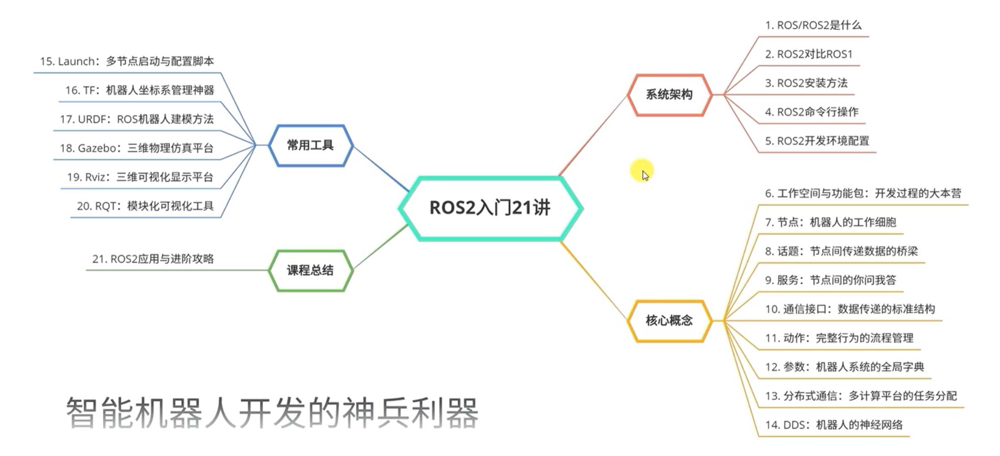
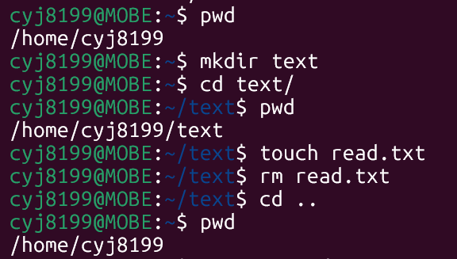
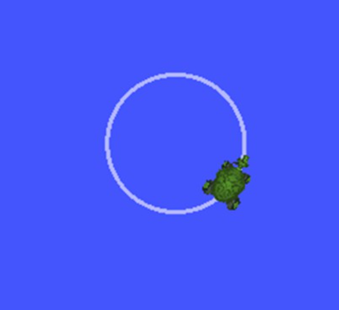

# 
系统架构

## 一. ROS/ROS2是什么？
ROS（ROS1和ROS2的总称）在自身的设计上尽量做到了模块化，由通信机制、开发工具、应用功能、生态系统四大部分组成。
ROS的社区：其实就是ROS相关资源的整合方式，比如wiki说明、问答网站、应用源码、论坛讨论等都算是社区中的元素。
> ROS全球社区有几个重要网站：

1. answers.ros.org，这是一个ROS问答网站，大家可以在上边提出任何关于ROS的问题，全球很多开发者都很乐意回答我们的问题；
2. wiki.ros.org，这是ROS的维基百科，记录了ROS教程和各种功能包的使用；
3. discourse.ros.org，这是ROS论坛，关于ROS开发的新鲜事都可以在这里发表和查看，比如ROS的活动、新功能包的发布等等。
4. index.ros.org，是ROS各种资源的一个索引网站；
5. packages.ros.org，是ROS功能包存储的数据库。
## 二. ROS2对比ROS1
+ 节点干掉了Master
+ 通信换成了DDS
+ 核心概念没变化
+ 编程难度有上升
## 三. ROS2命令行操作
### 1. 启动方式
回到命令行来，一系列的命令都是通过字符的方式输入的，怎么输入呢，并不是使用写字本，而是使用专门的软件，叫做==Terminal（终端）==。

*启动终端的方式有很多种：*
+ 在应用列表中打开
+ 快捷键Ctrl+Alt+T打开（有些电脑不适用）
+ 鼠标右键选择打开终端
### 2. 常用命令操作
+  cd
语法：cd <目录路径>
功能：改变工作目录。若没有指定“目录路径”，则回到用户的主目录
+ pwd
语法：pwd
功能：此命令显示出当前工作目录的绝对路径
+ mkdir
语法：mkdir [选项] <目录名称>
功能：创建一个目录/文件夹
+ ls
语法：ls [选项] [目录名称…]
功能：列出目录/文件夹中的文件列表
+ gedit
语法：gedit <文件名称>
功能：打开gedit编辑器编辑文件，若没有此文件则会新建
+ mv
语法：mv [选项] <源文件或目录> <目地文件或目录>
功能：为文件或目录改名或将文件由一个目录移入另一个目录中
+ cp
语法：cp [选项] <源文件名称或目录名称> <目的文件名称或目录名称>
功能：把一个文件或目录拷贝到另一文件或目录中，或者把多个源文件复制到目标目录中
+ rm
语法：rm [选项] <文件名称或目录名称…>
功能：该命令的功能为删除一个目录中的一个或多个文件或目录，它也可以将某个目录及其下的所有文件及子目录均删除。对于链接文件，只是删除了链接，原有文件均保持不变
+ sudo
语法：sudo [选项] [指令]
功能：以系统管理员权限来执行指令

### 3. ROS2中的命令行
1. 运行节点程序
+ 运行海龟仿真节点
`$ ros2 run turtlesim turtlesim_node`
+ 运行键盘控制节点
`$ ros2 run turtlesim turtle_teleop_key`
> 要分别开两个终端，将运行键盘控制节点的终端放到主页面才可以运行小海龟
2. 查看节点信息
`$ ros2 node list`
如果对某一个节点感兴趣，加上一个info子命令，就可以知道它的详细信息啦：
`$ ros2 node info /turtlesim `
3. 查看话题信息
`$ ros2 topic list`
还想看到某一个话题中的消息数据，加上echo子命令试一试：
`$ ros2 topic echo /turtle1/pose `
4. 发布话题消息
想要控制海龟动起来，我们还可以直接通过命令行发布话题指令：
`$ ros2 topic pub --rate 1 /turtle1/cmd_vel geometry_msgs/msg/Twist "{linear: {x: 2.0, y: 0.0, z: 0.0}, angular: {x: 0.0, y: 0.0, z: 1.8}}"`
> 海龟就可以转圈圈了

5. 发送服务请求   
一只海龟太孤单，仿真器还提供改了一个服务——产生海龟，我们试一试服务调用，再来一只海龟：
`$ ros2 service call /spawn turtlesim/srv/Spawn "{x: 2, y: 2, theta: 0.2, name: ''}"`
6. 录制与复现控制命令
+ 数据的录制：`$ ros2 bag record /turtle1/cmd_vel`
+ 数据的播放：`$ ros2 bag play rosbag2_2022_04_11-17_35_40/rosbag2_2022_04_11-17_35_40_0.db3`