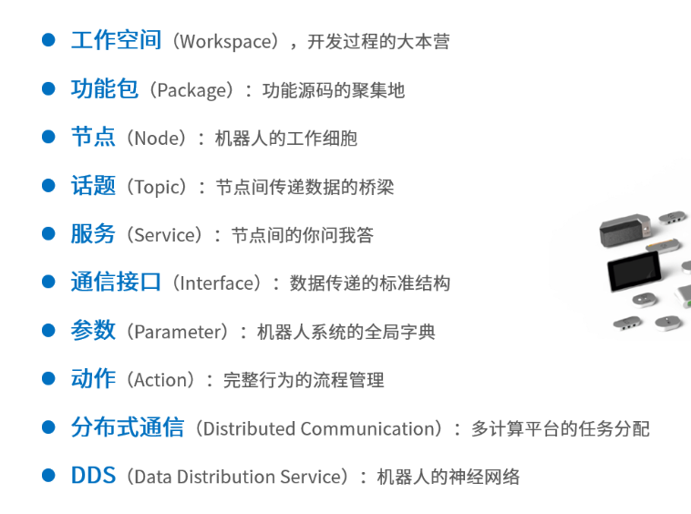
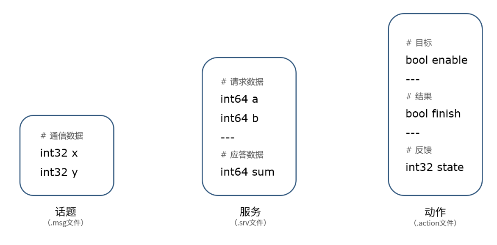
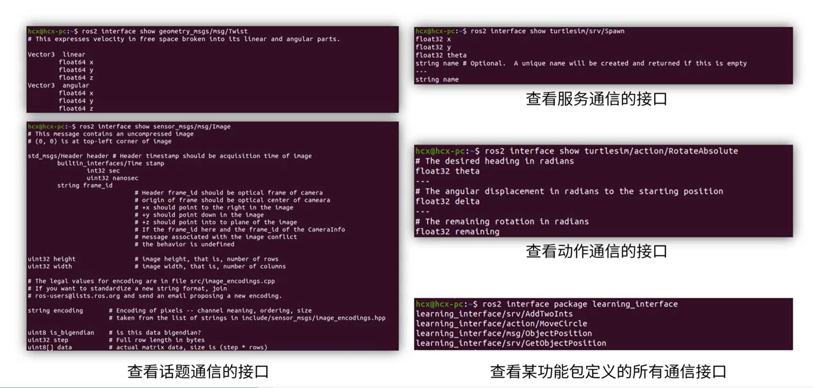
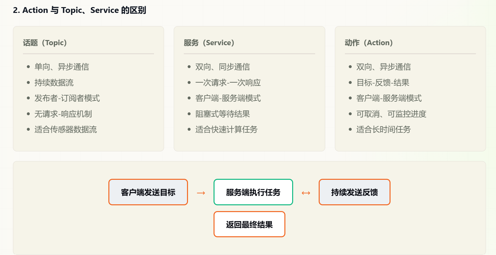

# <center>核心概念</center>
## 一. 工作空间
### 1.工作空间是什么
工作空间是一个存放项目开发相关文件的文件夹，也是开发过程中存放所有资料的大本营。
+ src，代码空间，未来编写的代码、脚本，都需要人为的放置到这里；
+ build，编译空间，保存编译过程中产生的中间文件；
+ install，安装空间，放置编译得到的可执行文件和脚本；
+ log，日志空间，编译和运行过程中，保存各种警告、错误、信息等日志。
> 在你当前这个 Ubuntu 终端里直接输入：
`explorer.exe .`
回车，会自动弹出 Windows 窗口，这里就能看到 build、install、log、src 四个文件夹。

针对Ubuntu24.04版本：
1. 创建工作空间
```
mkdir -p ~/dev_ws/src
cd ~/dev_ws/src
git clone shturl.cc/q3mLqDLNAnnbq95OD3zx7iBKiCIp3UUJgcCIAvj
```
2. 自动安装依赖
+ 安装 pip
  `sudo apt install -y python3-pip`
+ 正确安装 rosdep
  `sudo apt install ros-dev-tools -y`
+ 初始化 + 更新 rosdep
  `sudo rosdep init
rosdep update`
+ 一键安装所有代码依赖（回到工作空间根目录）
`cd ~/dev_ws
rosdep install -i --from-path src --rosdistro humble -y`
3. 编译工作空间
+ 安装编译工具 colcon
  `sudo apt install python3-colcon-ros -y`
+ 编译
  `cd ~/dev_ws
colcon build`
## 二. 功能包
### 1. 创建功能包
如何在ROS2中创建一个功能包呢？我们可以使用这个指令：
`$ ros2 pkg create --build-type <build-type> <package_name>`
ros2命令中：
+ pkg：表示功能包相关的功能；
+ create：表示创建功能包；
+ build-type：表示新创建的功能包是C++还是Python的，如果使用C++或者C，那这里就跟ament_cmake，如果使用Python，就跟ament_python；
+ package_name：新建功能包的名字。
`cd ~/dev_ws/src`  ==一定要先在这个目录下==
`ros2 pkg create --build-type ament_cmake learning_pkg_c  # C++`
`ros2 pkg create --build-type ament_python learning_pkg_python # Python`
### 2.编译功能包
在创建好的功能包中，我们可以继续完成代码的编写，之后需要编译和配置环境变量，才能正常运行：
```
$ cd ~/dev_ws
$ colcon build   # 编译工作空间所有功能包
$ source install/local_setup.bash
```
## 三. 节点
### 创建节点流程：
想要实现一个节点，代码的实现流程是这样做：
+ 编程接口初始化
+ 创建节点并初始化
+ 实现节点功能
+ 销毁节点并关闭接口
```
import rclpy                                   # ROS2 Python接口库
from rclpy.node import Node                    # ROS2 节点类


class HelloNode(Node):
    def __init__(self):
        super().__init__('hello_node')           # ROS2节点父类初始化
        self.get_logger().info('Hello World!')   # ROS2日志输出


def main(args=None):                                # ROS2节点主入口main函数
    rclpy.init(args=args)                            # ROS2 Python接口初始化
    node = HelloNode()                              # 创建ROS2节点对象并进行初始化
    rclpy.spin(node)                                 # 循环等待ROS2退出
    node.destroy_node()                            # 销毁节点对象
    rclpy.shutdown()                               # 关闭ROS2 Python接口


if __name__ == '__main__':
    main()
```
<u>节点命令的常用操作如下：</u>
```
$ ros2 node list               # 查看节点列表
$ ros2 node info <node_name>   # 查看节点信息
```

## 四. 话题
### 1. 如果我们想要实现一个发布者，流程如下：
+ 编程接口初始化
+ 创建节点并初始化
+ 创建发布者对象
+ 创建并填充话题消息
+ 发布话题消息
+ 销毁节点并关闭接口
### 2. 如果我们想要实现一个订阅者，流程如下：
+ 编程接口初始化
+ 创建节点并初始化
+ 创建订阅者对象
+ 回调函数处理话题数据
+ 销毁节点并关闭接口
### 3. 使用命令行工具验证话题通信
1. 查看当前话题列表
`ros2 topic list`
2. 查看话题消息内容
`ros2 topic echo /learn_topic # 注意替换为自己的消息名称`
将持续显示发布者发送的消息内容。
3. 查看话题信息
`ros2 topic info /learn_topic`
可查看该话题的消息类型以及发布者/订阅者数量。
**解决Package 'learn_topic' not found 问题**
1.确认包存在
`ls ~/dev_ws/src`
2.回到工作空间根目录
`cd ~/dev_ws`
3.删除旧编译垃圾
`rm -rf build install log`
4.编译learn_topic
`colcon build --packages-select learn_topic`
5.刷新环境
`source install/setup.bash`
6.验证包
`ros2 pkg list | grep learn_topic`
7.启动发布节点
`ros2 run learn_topic publisher`
## 五. 服务
### 1. 如果我们想要实现一个客户端，流程如下：
+ 编程接口初始化
+ 创建节点并初始化
+ 创建客户端对象
+ 创建并发送请求数据
+ 等待服务器端应答数据
+ 销毁节点并关闭接口
### 2. 如果我们想要实现一个服务端，流程如下：
+ 编程接口初始化
+ 创建节点并初始化
+ 创建服务器端对象
+ 通过回调函数处进行服务
+ 向客户端反馈应答结果
+ 销毁节点并关闭接口
**ROS2 Python 功能包新建 service_client.py 完整步骤:**
1. 先 cd 进入代码文件夹
`cd ~/你的工作空间名/src/learn_service/learn_service`
==ex.==`cd ~/dev_ws/src/learn_service/learn_service`
2. 创建空白文件
`touch service_client.py`
3. 打开编写代码
用 VS Code：`code service_client.py`
4. 重新编译更新代码
`cd ~/dev_ws
rm -rf build install log
colcon build --packages-select learn_service
source install/setup.bash`
5. 分两个终端运行
+ 终端 1（先开服务端，保持不关闭）
`ros2 run learn_service service_adder_server`
+ 终端 2（客户端，带两个数字参数）
`ros2 run learn_service service_adder_client 10 20`
### 3. 使用命令行工具验证服务通信
1. 查看当前服务列表
`ros2 service list`
2. 查看服务类型
`ros2 service type /add_two_ints`
3. 直接通过命令行调用服务
本质是通过命令行模拟了一个客户端：
```
# 格式 ros2 service call 服务名 数据接口 "{字典形式表示的请求数据}"
ros2 service call /add_two_ints example_interfaces/srv/AddTwoInts "{a: 4, b: 5}"
```
## 六. 通信接口


```
bool get      # 获取目标位置的指令
---
int32 x       # 目标的X坐标
int32 y       # 目标的Y坐标
```
### 1. 什么是接口
在 ROS 2 中，接口（Interface）是节点之间通信的"数据契约"。它定义了数据的结构和类型，确保不同节点之间能够正确理解和处理数据。
##### ROS2 提供了三种主要接口类型：
+ ==消息（msg）==
用于话题通信
单向、持续的数据流
+ ==服务（srv）==
用于服务通信
请求-响应模式
+ ==动作（action）==
用于动作通信
可反馈的长时间任务
### 2.使用命令行工具验证
1. 查看话题列表
`ros2 topic list`
2. 查看话题信息
`ros2 topic info /student_info`
3. 手动发布消息
`ros2 topic pub /student_info student_interfaces/msg/Student "{name: '测试', age: 22, height: 170.0, grade: '一年级', is_graduated: false}"`
4. 查看服务列表
`ros2 service list`
5. 手动调用服务
`ros2 service call /get_student_info student_interfaces/srv/StudentInfo "{student_id: '002'}"`
## 七. 动作
动作（Action）是一种用于执行长时间运行任务的通信机制。它结合了话题和服务的特点，提供了一种更灵活的异步通信方式。
> 动作的核心特点
+ 目标（Goal）：
客户端发送的任务目标
+ 反馈（Feedback）：
服务端定期发送的任务进度信息
+ 结果（Result）：
任务完成后返回的最终结果

### 1.action 文件结构
动作接口通过 .action 文件定义，包含三个部分：
+ 目标（Goal）部分 - 客户端发送给服务端的请求数据
`int64 target_count`
---
+ 结果（Result）部分 - 任务完成后返回的数据
```
int64 final_count
bool success
string message
```
---
+ 反馈（Feedback）部分 - 任务执行过程中的进度信息
```
int64 current_count
float64 progress
```
.action 文件使用 --- 分隔符来区分三个部分：

第一部分（Goal）：定义目标请求数据
第二部分（Result）：定义最终结果数据
第三部分（Feedback）：定义实时反馈数据
### 2.使用命令行工具验证 Action
1. 查看动作列表
`ros2 action list`
2. 查看动作信息
`ros2 action info /countdown`
3. 通过命令行发送动作目标
```
# 格式: ros2 action send_goal 动作名 动作类型 "{目标数据}"
ros2 action send_goal /countdown action_interfaces/action/Countdown "{target_number: 3}"
```
添加 --feedback 参数可以查看反馈信息：
```
ros2 action send_goal /countdown action_interfaces/action/Countdown "{target_number: 3}" --feedback
```
#### 动作通信的关键要点
+ 服务端通过 ActionServer 创建，处理目标和发送反馈
+ 客户端通过 ActionClient 创建，发送目标和接收结果
+ 使用 ReentrantCallbackGroup 防止回调阻塞
#### 动作与服务的选择

| 场景                 | 推荐方式 | 原因                         |
| :------------------- | :------: | :--------------------------- |
| 快速查询/计算（毫秒级） |   服务   | 一次请求-响应即可完成        |
| 长时间任务（秒级以上） |   动作   | 需要进度反馈和取消能力       |
| 需要实时监控进度      |   动作   | 支持持续反馈机制             |
| 需要中断执行          |   动作   | 支持目标取消功能             |
## 八. 参数
### 1.常用操作
1. 查看参数列表
`$ ros2 param list`
2. 参数查询与修改
```
$ ros2 param describe turtlesim background_b   # 查看某个参数的描述信息
$ ros2 param get turtlesim background_b        # 查询某个参数的值
$ ros2 param set turtlesim background_b 10     # 修改某个参数的值
```
>使用 ros2 param set 设置参数值时，节点必须正在运行。该命令会立即修改运行中节点的参数值，但不会持久化保存。节点重启后参数将恢复为代码中的默认值或启动时指定的值。
3. 参数文件保存与加载
一个一个查询/修改参数太麻烦了，不如试一试参数文件，ROS中的参数文件使用yaml格式
```
$ ros2 param dump turtlesim >> turtlesim.yaml  # 将某个节点的参数保存到参数文件中
$ ros2 param load turtlesim turtlesim.yaml     # 一次性加载某一个文件中的所有参数
```
4. ros2 param delete - 删除参数
```
# 删除指定参数（仅对动态声明的参数有效）
ros2 param delete /countdown_action_server temp_parameter
```
>参数删除限制
在代码中使用 declare_parameter() 声明的参数是静态参数，通常无法通过 ros2 param delete 删除。只有通过代码动态添加的参数才可以被删除。
### 2.YAML 配置文件批量赋值
当参数较多时，使用 YAML 配置文件进行批量管理更加方便。
1. 创建 YAML 配置文件
    1.回到功能包根目录
    ` cd ~/dev_ws/src/learn_action`
    2.创建config文件夹
    `mkdir config`
    3.创建yaml 文件
    `touch config/params.yaml`
2. 使用 YAML 文件启动节点
    `ros2 run learn_action countdown_server --ros-args --params-file config/params.yaml`
## 九. DDS
DDS的全称是Data Distribution Service，也就是数据分发服务.DDS强调以数据为中心，可以提供丰富的服务质量策略，以保障数据进行实时、高效、灵活地分发，可满足各种分布式实时通信应用需求。
### 1.在命令行中配置DDS
启动第一个终端，我们使用best_effort创建一个发布者节点，循环发布任意数据
`$ ros2 topic pub /chatter std_msgs/msg/Int32 "data: 42" --qos-reliability best_effort `
在另外一个终端中,同样的best_effort，才能实现数据传输。
`$ ros2 topic echo /chatter --qos-reliability best_effort`
如何去查看ROS2系统中每一个发布者或者订阅者的QoS策略呢，在topic命令后边跟一个"--verbose"参数就行了。
`$ ros2 topic info /chatter --verbose`
